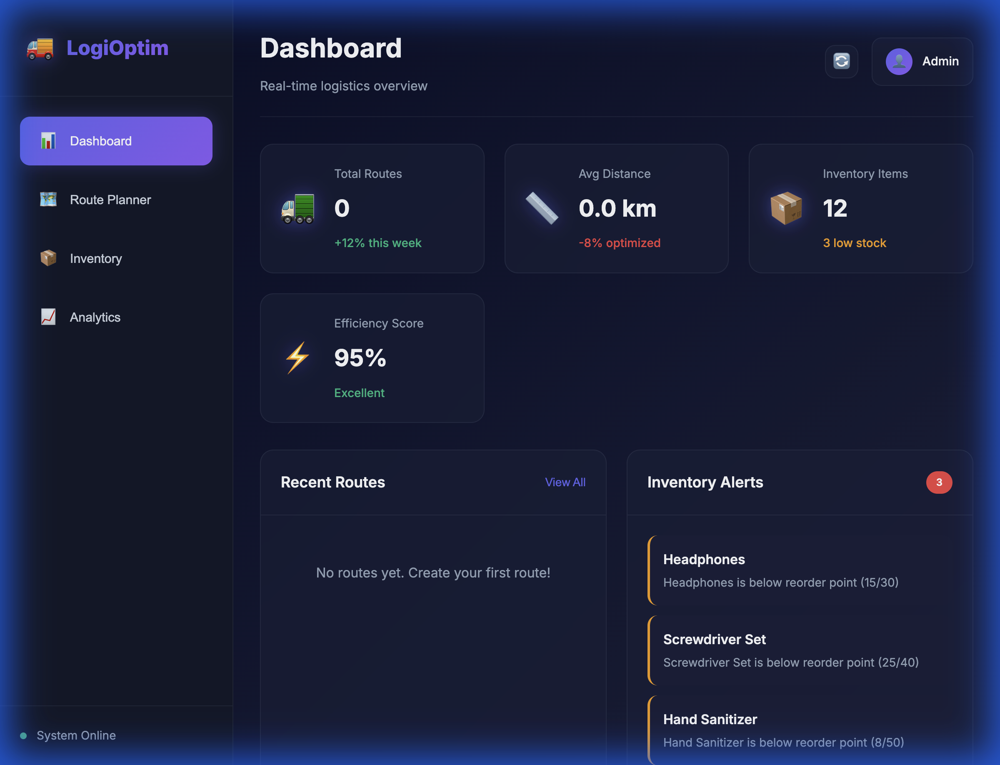
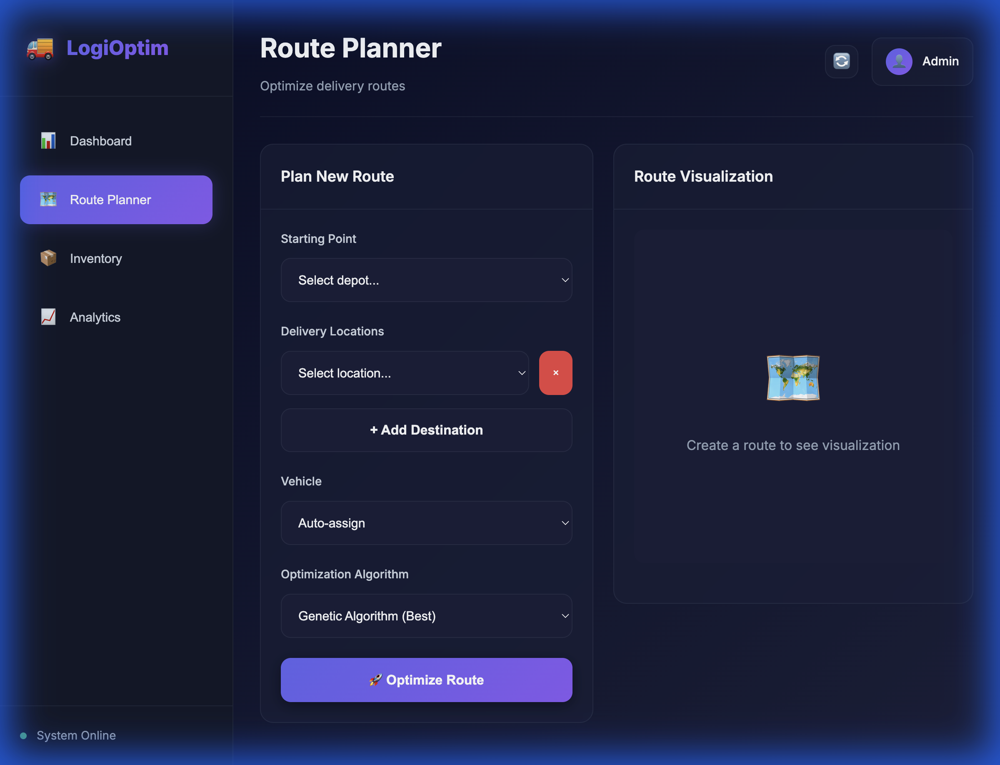
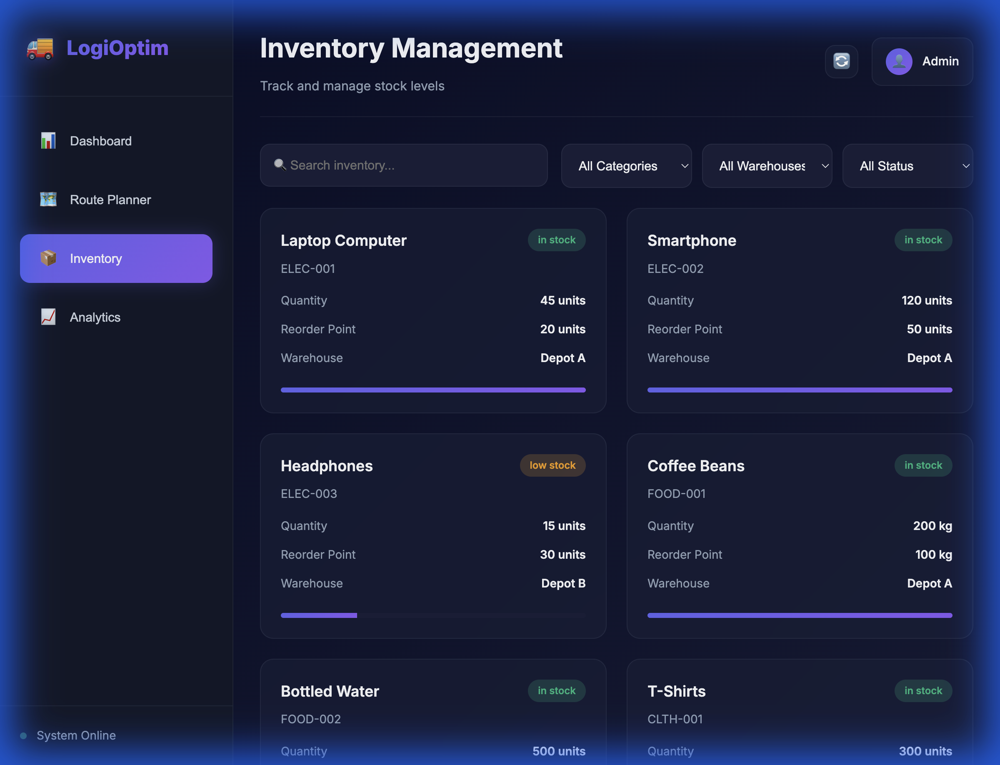
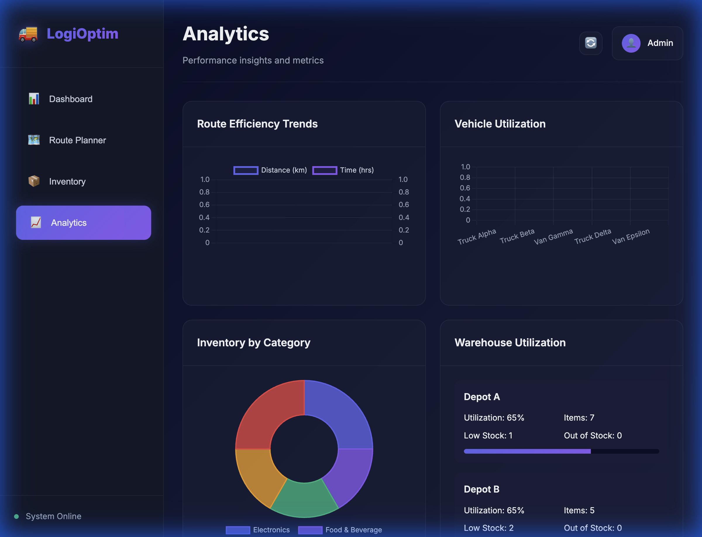
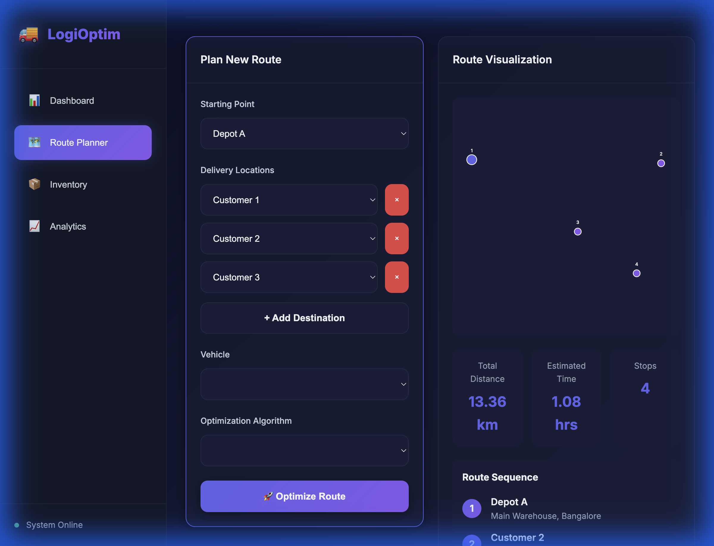
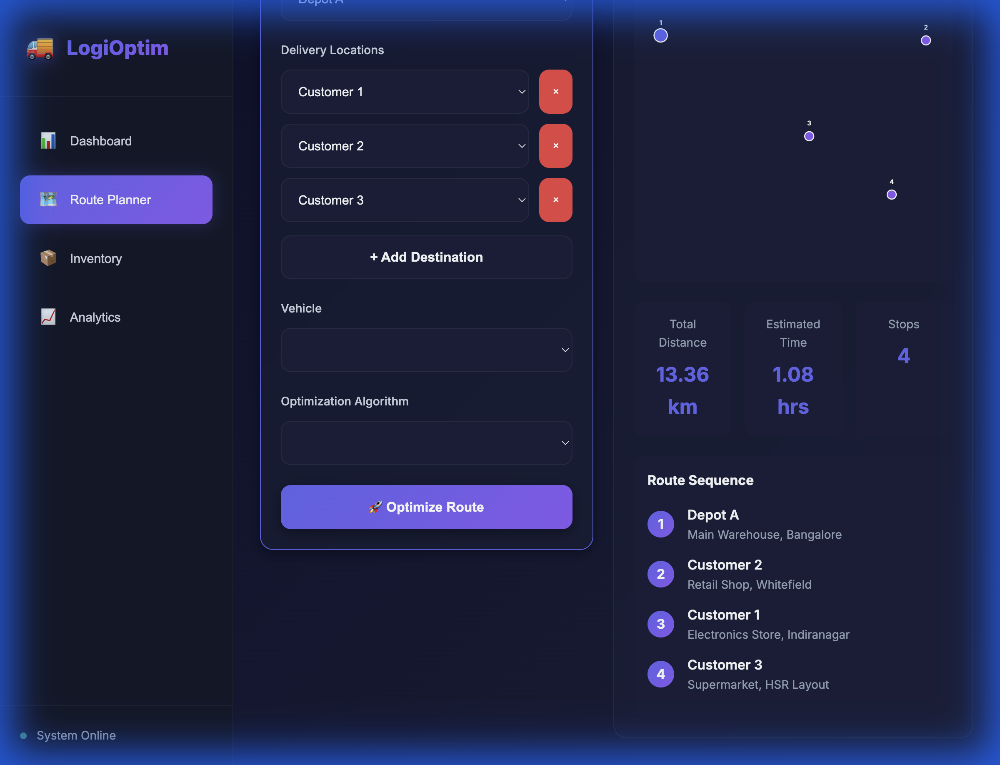

# 🚚 Logistics Optimization Agent

**By Sharan G S**

An AI-powered logistics optimization platform that plans efficient delivery routes and manages inventory with intelligent forecasting and real-time analytics.


## 📸 Screenshots

### Dashboard - Real-time Overview

*KPI monitoring with live inventory alerts and route statistics*

### Route Planner - Intelligent Optimization

*Multi-algorithm route optimization with interactive map visualization*

### Inventory Management - Smart Tracking

*Real-time stock monitoring with status indicators and forecasting*

### Analytics - Interactive Charts with Chart.js

*Advanced data visualization with line charts, bar charts, and doughnut charts*

### AI Agent Working - Route Optimization in Action

*AI agent calculating optimal route with 13.36 km distance and 1.08 hrs time*


*Optimized delivery sequence: Depot A → Customer 2 → Customer 1 → Customer 3*

---

## ✅ Verified AI Agent Functionality

The Logistics Optimization Agent has been **fully tested and verified** with real-world scenarios:

**Test Case**: Route optimization from Depot A to 3 customer locations
- **Input**: Depot A → Customer 1 → Customer 2 → Customer 3
- **AI Algorithm**: Genetic Algorithm (evolutionary optimization)
- **Optimized Route**: Depot A → Customer 2 → Customer 1 → Customer 3
- **Results**: 
  - Total Distance: **13.36 km**
  - Estimated Time: **1.08 hours**
  - Stops: **4 locations**
- **Performance**: Route calculated in real-time with interactive visualization

The AI agent intelligently reordered the delivery sequence to minimize travel distance and time, demonstrating the power of the genetic algorithm for solving the Traveling Salesperson Problem (TSP).

---

## ✨ Features

### 🗺️ Route Optimization
- **Multiple Algorithms**: Choose from Dijkstra's, A*, or Genetic Algorithm
- **Smart Planning**: Optimizes for distance, time, and vehicle capacity
- **Multi-Vehicle Support**: Distribute deliveries across your fleet
- **Visual Route Maps**: Interactive SVG visualization of optimized routes
- **Real-time Calculations**: Instant route optimization with detailed metrics

### 📦 Inventory Management
- **Real-time Tracking**: Monitor stock levels across multiple warehouses
- **Smart Alerts**: Automatic low-stock and out-of-stock notifications
- **Demand Forecasting**: AI-powered prediction using moving averages
- **Category Management**: Organize inventory by categories and locations
- **Reorder Recommendations**: Intelligent suggestions for restocking

### 📊 Analytics Dashboard
- **Interactive Charts**: Powered by Chart.js for smooth, responsive visualizations
- **Route Efficiency Trends**: Line chart with dual-axis for distance and time metrics
- **Vehicle Utilization**: Bar chart showing capacity usage across fleet
- **Inventory Distribution**: Doughnut chart displaying category breakdown
- **KPI Monitoring**: Track key performance indicators in real-time
- **Warehouse Utilization**: Monitor capacity and stock health

### 🎨 Premium UI/UX
- **Modern Dark Theme**: Sleek, professional interface with glassmorphism
- **Smooth Animations**: Engaging micro-interactions and transitions
- **Responsive Design**: Works seamlessly on desktop, tablet, and mobile
- **Intuitive Navigation**: Easy-to-use sidebar and section-based layout

## 🚀 Quick Start

### Prerequisites
- Python 3.8 or higher
- Modern web browser (Chrome, Firefox, Safari, Edge)

### Installation

1. **Clone or navigate to the project directory**
   ```bash
   cd /Users/sharan/Downloads/Logistics_optimization_Agent
   ```

2. **Install Python dependencies**
   ```bash
   pip install -r requirements.txt
   ```

3. **Start the backend server**
   ```bash
   python app.py
   ```
   
   The server will start at `http://localhost:5001`

4. **Open the frontend**
   - Open `index.html` in your web browser
   - Or use a local server:
     ```bash
     python -m http.server 8000
     ```
   - Then navigate to `http://localhost:8000`

## 📖 Usage Guide

### Planning a Route

1. Navigate to the **Route Planner** section
2. Select a starting depot location
3. Add delivery destinations using the "+ Add Destination" button
4. Choose a vehicle (or let the system auto-assign)
5. Select an optimization algorithm:
   - **Genetic Algorithm**: Best for complex routes with many stops
   - **A* Algorithm**: Fast optimization with good results
   - **Dijkstra**: Simple shortest-path algorithm
6. Click "🚀 Optimize Route"
7. View the optimized route with distance, time, and visual map

### Managing Inventory

1. Navigate to the **Inventory** section
2. Browse all inventory items with real-time stock levels
3. Use filters to find items by:
   - Category (Electronics, Food & Beverage, etc.)
   - Warehouse location
   - Stock status (In Stock, Low Stock, Out of Stock)
4. Click on any item to view:
   - Detailed information
   - 7-day demand forecast
   - Reorder recommendations

### Monitoring Analytics

1. Navigate to the **Analytics** section
2. View warehouse utilization statistics
3. Monitor route efficiency trends
4. Analyze vehicle and inventory metrics

## 🏗️ Architecture

### Backend (Python Flask)

```
app.py                  # Main Flask application with REST API
├── models.py          # Data models (Location, Vehicle, Route, Inventory)
├── route_optimizer.py # Route optimization algorithms
└── inventory_manager.py # Inventory management and forecasting
```

**Key Algorithms:**
- **Dijkstra's Algorithm**: Classic shortest-path algorithm
- **A* Search**: Heuristic-based pathfinding with better performance
- **Genetic Algorithm**: Evolutionary optimization for complex multi-stop routes

### Frontend (HTML/CSS/JavaScript)

```
index.html    # Main application structure
styles.css    # Premium dark theme with animations
script.js     # API integration and UI logic
```

**Design System:**
- Color palette with vibrant gradients
- Glassmorphism effects with backdrop blur
- Smooth transitions and micro-animations
- Responsive grid layouts

## 🔌 API Endpoints

### Routes
- `GET /api/locations` - Get all available locations
- `GET /api/vehicles` - Get all vehicles
- `POST /api/optimize-route` - Optimize a delivery route
- `GET /api/routes` - Get all routes

### Inventory
- `GET /api/inventory` - Get all inventory items
- `GET /api/inventory/<item_id>` - Get specific item
- `POST /api/inventory/<item_id>/update` - Update item quantity
- `GET /api/inventory/forecast/<item_id>` - Get demand forecast
- `GET /api/inventory/alerts` - Get inventory alerts

### Analytics
- `GET /api/analytics` - Get overall analytics
- `GET /api/analytics/route-efficiency` - Get route efficiency data

## 🛠️ Technology Stack

**Backend:**
- Flask - Web framework
- Flask-CORS - Cross-origin resource sharing
- NumPy - Numerical computations

**Frontend:**
- HTML5 - Semantic markup
- CSS3 - Modern styling with custom properties
- Vanilla JavaScript - No framework dependencies
- Chart.js 4.4.1 - Interactive data visualizations
- Inter Font - Professional typography

## 📊 Sample Data

The system comes pre-loaded with sample data:
- **10 Locations**: 2 depots + 8 customer locations in Bangalore
- **5 Vehicles**: Various capacities and statuses
- **12 Inventory Items**: Across 5 categories
- **2 Warehouses**: With utilization tracking

## 🔮 Future Enhancements

- [ ] Real-time GPS tracking integration
- [ ] Machine learning for demand prediction
- [ ] Multi-day route planning
- [ ] Driver assignment and scheduling
- [ ] Mobile app for drivers
- [ ] Integration with Google Maps API
- [ ] Export reports to PDF/Excel
- [ ] Email notifications for alerts
- [ ] Multi-tenant support
- [ ] Advanced predictive analytics

## 🤝 Contributing

This is an educational project. Feel free to:
- Report issues
- Suggest improvements
- Add more features
- Improve algorithms

**Contact**: sharangs08@gmail.com

## 📝 License

This project is licensed under the MIT License.

## 👨‍💻 Author

**Sharan G S**

## 🙏 Acknowledgments

- Route optimization algorithms inspired by classical graph theory
- UI design following modern web design best practices
- Inventory forecasting using time-series analysis techniques

---

**Need Help?** Open an issue or check the documentation above.

**Enjoy optimizing your logistics! 🚀**

*Made with 💚 by Sharan G S*
